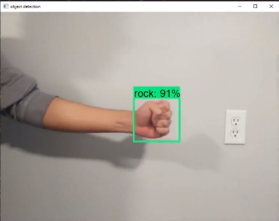
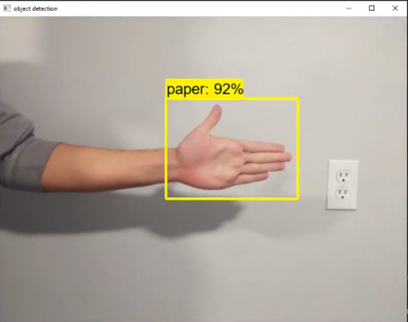
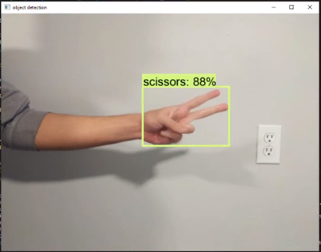
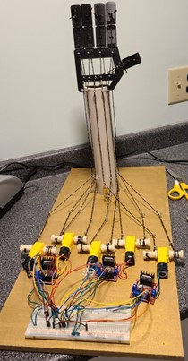

# Description
This project aimed to create a robot that aims to play rock, paper, scissors vs a human player. This repsoitoy shows the section I was responsible for as a part of this project.The machine responds to the human player after observing them through the camera, and responds accordingly. After pressing a button, a sequence on a screen plays “ rock, paper, scissors shoot”. As the human player moves their hand the streamed video is chopped up and passed to a buffer queue of 7 frames. The result is then tallied up and a response is calculted in return. The response gets sent to a raspberry pi which moves a robotic hand to playout the response. This repository only contains the final versions of the code used, it was not used as a CI/CD tool.

# Model and extra information

The detection was done by training a CNN and using tensorflow 2 to get a pretrained model to utilize transfer learning.

A total of 4000 images where orignially labelled. The data was then augmented with different contrasts and lighting changes via Python scripts which greatly increased the amount images used to train the model to 24k images. This yielded siginficantly better results in different lighting and detecting the shapes we were after.
After testing various models the *SSD MobileNet v2 320x320* from the tensor flow model zoo yielded the best results.

# Proof of concept test

# Results from the best model

  
# Mechanical hand that responds to the  human player

